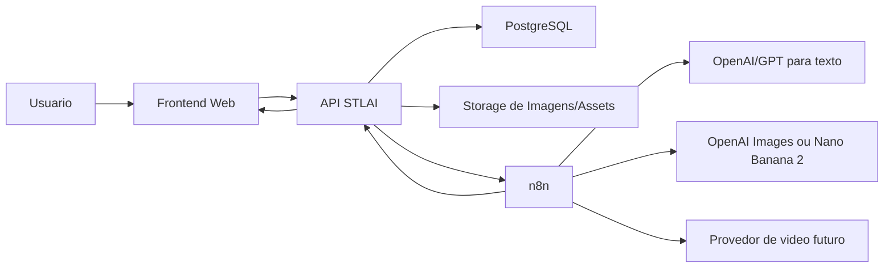
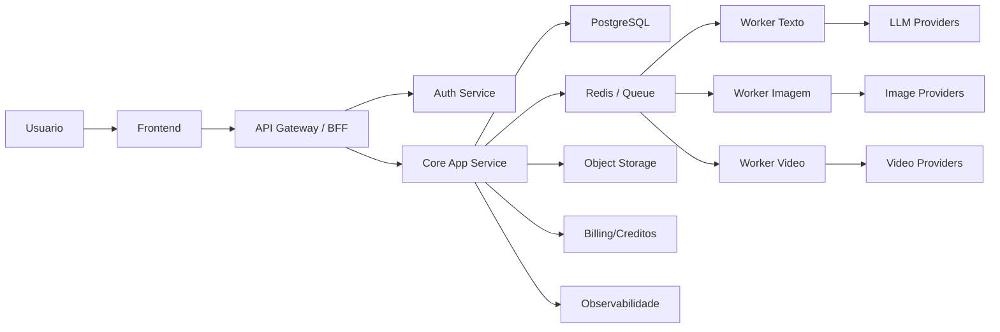

# Arquitetura do MVP STLAI

## 1. Objetivo do produto

Construir um MVP de uma plataforma que recebe de 1 a 5 imagens de um produto e gera automaticamente:

- titulos otimizados para marketplace
- descricao completa do produto
- imagens derivadas do produto
- imagens tecnicas com medidas
- no futuro, videos promocionais e avatar falando sobre o produto

O foco inicial do MVP e validar:

- se a entrada com poucas fotos e contexto simples gera saidas boas
- se o fluxo completo fica rapido e compreensivel para o usuario
- se a qualidade das imagens e textos e suficiente para conversao
- se o modelo de creditos com regeneracao faz sentido

## 2. Leitura da sua visao

Sua visao esta bem alinhada com um MVP viavel. O melhor caminho agora nao e tentar construir tudo de forma pesada desde o inicio, e sim separar o produto em 3 pipelines independentes:

1. pipeline de texto
2. pipeline de imagem
3. pipeline de video

Para o MVP, eu recomendo:

- entregar texto e imagem primeiro
- deixar video como modulo desacoplado e opcional
- usar o n8n como orquestrador principal de automacoes
- colocar uma API leve na frente do n8n para dar seguranca, controle e padronizacao para o frontend

Esse ponto e importante: o frontend nao deve falar diretamente com varios provedores nem depender da logica dentro do n8n. O frontend deve conversar com uma camada de aplicacao propria da STLAI.

## 3. Arquitetura simples para o MVP

### 3.1 Componentes

Arquitetura recomendada:

- Frontend web
- API backend leve
- n8n para orquestracao
- banco de dados
- storage de arquivos
- provedores de IA

Stack sugerida:

- Frontend: Next.js
- Backend/API: Next.js API Routes ou NestJS/Express
- Automacao: n8n
- Banco: PostgreSQL
- Storage: S3/Cloudflare R2/Supabase Storage
- Fila assicrona: Redis + BullMQ ou fila nativa simples via banco no inicio

### 3.2 Desenho logico



### 3.3 Responsabilidades

#### Frontend

Responsavel por:

- upload de 1 a 5 imagens
- formulario de contexto do produto
- disparar geracao
- mostrar status da geracao
- exibir resultados
- permitir aprovar texto
- permitir regenerar imagens
- controlar UX de consumo de creditos

#### API STLAI

Responsavel por:

- autenticacao
- receber upload e salvar no storage
- criar projeto e job de geracao
- validar quantidade de imagens e campos obrigatorios
- enviar payload padronizado para o n8n
- receber retorno dos fluxos
- salvar resultado estruturado no banco
- controlar creditos
- expor endpoints para frontend consultar status e resultados

#### n8n

Responsavel por:

- orquestrar fluxos assincornos
- chamar APIs de IA
- aplicar regras de negocio de automacao
- separar fan-out e fan-in das geracoes
- registrar logs tecnicos
- notificar backend ao concluir etapas

#### Banco

Responsavel por:

- usuarios
- projetos
- assets enviados
- jobs de geracao
- resultados de texto
- resultados de imagem
- consumo de creditos
- historico de regeneracoes

#### Storage

Responsavel por:

- armazenar imagens originais
- armazenar imagens processadas
- armazenar spritesheets/combos, se existirem
- armazenar videos futuros

## 4. Fluxo ideal do MVP

### Tela 1 - Upload

Entrada:

- 1 a 5 imagens

Regras:

- minimo de 1 imagem
- maximo de 5 imagens
- preview antes de continuar
- permitir remover e substituir

Saida:

- cria `project`
- cria `source_assets`

### Tela 2 - Contexto do produto

Entrada:

- nome do produto
- categoria
- contexto/observacoes
- dimensoes X, Y e Z se houver
- peso se houver
- voltagem se houver
- idioma
- plano basico/premium

Saida:

- cria `generation_profile`

### Tela 3 - Geracao de textos

Pipeline:

- API envia job ao n8n
- n8n chama LLM
- LLM devolve 4 titulos + 1 descricao estruturada
- backend salva
- frontend apresenta para aprovacao

Regra importante:

- o usuario deve aprovar o texto antes da etapa de video

### Tela 4 - Geracao de imagens

Pipeline:

- API envia job de imagem ao n8n
- n8n monta prompt com produto, contexto e medidas
- provedor gera uma imagem composta ou multiplas imagens
- backend/processador separa os quadrantes se vier uma imagem unica
- salva assets finais no storage
- frontend exibe grid

Pacote recomendado do MVP:

- 1 imagem fundo branco
- 1 imagem de medidas
- 4 imagens ambientadas
- 1 imagem focada em caracteristicas
- 1 imagem combo ou composicao

Total:

- 8 imagens por geracao padrao

### Tela 5 - Geracao de videos

No MVP:

- manter como `coming soon` ou beta fechado
- ja deixar a arquitetura preparada para plugar um provider depois

### Tela 6 - Resumo final

Consolida:

- titulos
- descricao
- imagens
- status de videos
- creditos gastos
- botoes de download

## 5. Melhor forma de estruturar os 3 fluxos

## 5.1 Fluxo de texto

Mais simples e confiavel:

- usar um unico LLM principal
- definir schema fixo de saida
- validar JSON no backend

Entrada do prompt:

- nome do produto
- categoria
- medidas
- atributos
- idioma
- fotos do produto
- restricoes por marketplace

Saida esperada:

```json
{
  "titles": [
    "Titulo 1",
    "Titulo 2",
    "Titulo 3",
    "Titulo 4"
  ],
  "description": "Descricao completa",
  "bullets": [
    "beneficio 1",
    "beneficio 2",
    "beneficio 3"
  ],
  "seo_keywords": [
    "palavra 1",
    "palavra 2"
  ]
}
```

Minha recomendacao:

- escolher um modelo principal para texto
- nao usar OpenAI e Gemini ao mesmo tempo no MVP para a mesma tarefa
- se quiser comparar, faca isso em ambiente interno, nao na primeira versao publica

Motivo:

- reduz custo
- reduz variacao de qualidade
- simplifica debugging

## 5.2 Fluxo de imagem

Sua ideia de gerar uma imagem com varias variacoes e depois cortar no backend e boa para MVP, principalmente se:

- o provider responde melhor com composicoes em grid
- o custo por chamada ficar melhor
- a consistencia visual entre variacoes aumentar

Pipeline sugerido:

1. receber imagem do usuario
2. remover ruído visual se necessario
3. gerar prompt mestre com contexto do produto
4. solicitar um painel com 4 ou 8 variacoes
5. cortar automaticamente as regioes
6. rodar validacao basica de qualidade
7. salvar assets finais

Tipos de imagem do MVP:

- catalogo fundo branco
- imagem com medidas
- lifestyle 1
- lifestyle 2
- lifestyle 3
- lifestyle 4
- destaque de caracteristica
- combo com 3 aplicacoes

Ponto importante:

Se o Nano Banana 2 esta entregando bem esse tipo de variacao com prompt simples, ele pode virar seu motor principal de imagem no MVP. A API do GPT Image pode entrar como fallback, para limpeza, expansao ou outros formatos no futuro.

Melhor decisao para agora:

- escolher 1 provedor principal de imagem
- manter 1 fallback tecnico
- nao misturar providers na mesma experiencia do usuario no inicio

## 5.3 Fluxo de video

Como voce ainda nao definiu a API, a melhor arquitetura e deixar o video desacoplado.

Estrutura:

- frontend mostra etapa de video como opcional
- backend cria `video_job`
- n8n chama um provider configuravel
- resultado volta como asset independente

Fluxo futuro:

1. usuario aprova texto
2. sistema cria roteiro curto
3. sistema escolhe template de video
4. provider gera video do produto
5. opcionalmente gera avatar narrando

Recomendacao:

- nao bloquear lancamento do MVP por video
- deixar pontos de extensao prontos desde ja

## 6. Recomendacao de arquitetura de dados

### Entidades principais

```text
User
Workspace
Project
UploadedAsset
ProductContext
GenerationJob
TextGenerationResult
ImageGenerationResult
VideoGenerationResult
CreditTransaction
RegenerationRequest
```

### Estrutura minima

#### Project

- id
- user_id
- status
- language
- plan_type
- created_at

#### UploadedAsset

- id
- project_id
- file_url
- file_type
- position

#### ProductContext

- id
- project_id
- product_name
- category
- dimensions_x
- dimensions_y
- dimensions_z
- weight_grams
- voltage
- additional_attributes_json

#### GenerationJob

- id
- project_id
- job_type (`text`, `image`, `video`)
- status (`queued`, `processing`, `completed`, `failed`)
- provider
- credits_spent
- error_message

#### TextGenerationResult

- id
- project_id
- titles_json
- description
- approved_by_user
- approved_at

#### ImageGenerationResult

- id
- project_id
- asset_url
- image_kind
- prompt_version
- provider

#### CreditTransaction

- id
- user_id
- project_id
- action_type
- credits_delta
- metadata_json

## 7. Como distribuir responsabilidades entre API e n8n

Essa divisao precisa ser clara para nao virar bagunca.

### Fica na API

- autenticacao
- autorizacao
- regras de plano e credito
- persistencia oficial do sistema
- API para frontend
- webhook receptor de callback
- versionamento de prompt
- idempotencia

### Fica no n8n

- execucao dos fluxos
- chamadas aos provedores
- retries
- montagem operacional do pipeline
- integracao entre servicos

### Nao deixar no n8n

- regra central de credito
- estado principal do produto
- autenticacao do frontend
- unica fonte de verdade do projeto

Resumo:

- n8n orquestra
- sua API governa

## 8. Arquitetura robusta para a versao completa

Quando o produto provar valor, a arquitetura pode evoluir para:

- frontend web
- backend modular
- workers especializados
- fila real de processamento
- observabilidade forte
- multi-provider por tipo de geracao

### Desenho alvo



### Evolucoes importantes

- separar workers por tipo de geracao
- criar versionamento de prompts
- criar sistema de score de qualidade
- ter fallback automatico entre provedores
- guardar seeds, prompts e metadata de reproducao
- usar webhook/event bus para atualizacao de status
- adicionar cache para assets e resultados

## 9. Melhor caminho de MVP versus overengineering

### Para o MVP, faca assim

- 1 frontend
- 1 API principal
- 1 banco
- 1 storage
- 1 n8n
- 1 provider principal de texto
- 1 provider principal de imagem
- video opcional

### Evite agora

- microservicos
- multi-cloud
- varios modelos concorrentes em producao
- sistema complexo de ranking de saida
- automacoes demais dentro do frontend

## 10. Minha opiniao sobre a sua direcao

Voce esta no caminho certo em 4 pontos:

- usar n8n para acelerar o backoffice e a orquestracao
- separar fluxo de texto, imagem e video
- permitir regeneracao de imagem como consumo adicional
- pedir contexto estruturado do produto antes da geracao

Os ajustes que eu faria sao:

1. nao deixar o frontend conversar direto com n8n
2. nao misturar varios provedores na mesma etapa logo no MVP
3. nao colocar video como dependencia para lancar
4. salvar tudo como jobs assincronos com status claro
5. tratar creditos como regra central do backend

## 11. Jornada recomendada do usuario no MVP

```text
1. Usuario cria projeto
2. Usuario envia de 1 a 5 imagens
3. Usuario preenche contexto do produto
4. Sistema gera textos
5. Usuario aprova ou regenera textos
6. Sistema gera imagens
7. Usuario baixa ou regenera imagens
8. Sistema exibe resumo final
9. Video entra como etapa opcional beta
```

## 12. Estrategia de creditos

Modelo simples para MVP:

- criar projeto: sem custo
- gerar textos: custo fixo
- gerar pacote de imagens: custo fixo
- regenerar imagens: novo custo
- gerar video: custo separado e mais alto

Importante:

- reservar credito antes de iniciar job
- confirmar consumo quando job completar
- devolver credito se job falhar de forma tecnica

## 13. Riscos principais

### Risco 1 - latencia alta

Mitigacao:

- jobs assincronos
- polling ou websocket no frontend
- status por etapa

### Risco 2 - imagem ruim ou inconsistente

Mitigacao:

- prompts versionados
- templates fixos de saida
- opcao de regenerar

### Risco 3 - custo explodir

Mitigacao:

- limitar quantidade de outputs por plano
- um provider principal por etapa
- creditos por regeneracao

### Risco 4 - n8n virar regra de negocio central

Mitigacao:

- manter estado e regra de negocio na API

## 14. Roadmap tecnico recomendado

### Fase 1 - MVP funcional

- upload de imagens
- formulario de contexto
- geracao de 4 titulos e 1 descricao
- geracao de 8 imagens
- resumo final
- creditos simples

### Fase 2 - MVP comercial

- historico de projetos
- regeneracao de imagem
- downloads em lote
- melhor tratamento de falhas
- templates por categoria

### Fase 3 - Produto robusto

- videos
- avatar narrador
- multiplos marketplaces com adaptacao por canal
- analytics de conversao
- recomendacao automatica de melhor criativo

## 15. Recomendacao final

Se fossemos iniciar o desenvolvimento hoje, eu seguiria assim:

### Arquitetura MVP recomendada

- Next.js no frontend
- API propria da STLAI no backend
- PostgreSQL
- S3/R2 para storage
- n8n como orquestrador
- 1 modelo principal para texto
- 1 modelo principal para imagem
- video desacoplado e posterior

### Decisao tecnica central

O melhor desenho nao e "frontend -> n8n -> APIs".

O melhor desenho e:

`frontend -> API STLAI -> banco/storage -> n8n -> providers -> API STLAI -> frontend`

Isso te da:

- mais controle
- mais seguranca
- mais escalabilidade
- mais facilidade para trocar providers depois

## 16. Proximos entregaveis que podemos criar agora

Posso seguir com qualquer um destes proximos passos:

1. desenhar a arquitetura tecnica em diagrama mais profissional
2. estruturar o banco de dados inicial com tabelas reais
3. definir os endpoints da API do MVP
4. desenhar os workflows do n8n etapa por etapa
5. estruturar o PRD tecnico do MVP
6. desenhar a arquitetura do frontend tela por tela
7. montar a estrategia de prompts para texto e imagem
