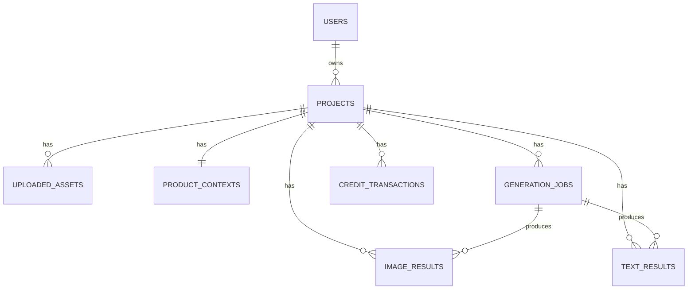

# Banco de Dados MVP STLAI

## Objetivo

Definir uma estrutura de banco simples, mas pronta para suportar:

- projetos
- upload de imagens
- contexto do produto
- jobs assincornos
- resultados de texto
- resultados de imagem
- creditos
- regeneracao

Banco recomendado para o MVP:

- PostgreSQL

## Visao geral das entidades



## Tabelas principais

## 1. users

Representa o usuario dono dos projetos.

```sql
create table users (
  id uuid primary key,
  email varchar(255) not null unique,
  name varchar(150),
  locale varchar(10) default 'pt-BR',
  created_at timestamptz not null default now(),
  updated_at timestamptz not null default now()
);
```

## 2. projects

Representa um anuncio ou processo de geracao.

```sql
create table projects (
  id uuid primary key,
  user_id uuid not null references users(id),
  name varchar(150),
  language varchar(10) not null default 'pt-BR',
  plan_type varchar(20) not null default 'basic',
  status varchar(30) not null default 'draft',
  cover_image_url text,
  created_at timestamptz not null default now(),
  updated_at timestamptz not null default now()
);
```

### Status sugeridos de project

- `draft`
- `context_completed`
- `text_generating`
- `text_review`
- `image_generating`
- `completed`
- `failed`

## 3. uploaded_assets

Guarda as imagens originais enviadas pelo usuario.

```sql
create table uploaded_assets (
  id uuid primary key,
  project_id uuid not null references projects(id) on delete cascade,
  storage_key text not null,
  file_url text not null,
  mime_type varchar(100) not null,
  width int,
  height int,
  size_bytes bigint,
  asset_role varchar(30) not null default 'source',
  sort_order int not null default 0,
  created_at timestamptz not null default now()
);
```

### asset_role sugerido

- `source`
- `reference`

## 4. product_contexts

Informacoes do produto usadas na geracao.

```sql
create table product_contexts (
  id uuid primary key,
  project_id uuid not null unique references projects(id) on delete cascade,
  product_name varchar(200) not null,
  category varchar(120),
  short_context text,
  dimensions_x_cm numeric(10,2),
  dimensions_y_cm numeric(10,2),
  dimensions_z_cm numeric(10,2),
  weight_grams numeric(10,2),
  voltage varchar(20),
  color varchar(80),
  material varchar(120),
  target_marketplaces jsonb,
  extra_attributes jsonb,
  created_at timestamptz not null default now(),
  updated_at timestamptz not null default now()
);
```

## 5. generation_jobs

Tabela central para controlar os pipelines.

```sql
create table generation_jobs (
  id uuid primary key,
  project_id uuid not null references projects(id) on delete cascade,
  job_type varchar(20) not null,
  status varchar(20) not null default 'queued',
  provider varchar(60),
  provider_job_id varchar(120),
  trigger_source varchar(30) not null default 'user',
  prompt_version varchar(40),
  credits_reserved int not null default 0,
  credits_spent int not null default 0,
  input_payload jsonb,
  output_payload jsonb,
  error_code varchar(60),
  error_message text,
  started_at timestamptz,
  completed_at timestamptz,
  created_at timestamptz not null default now()
);
```

### job_type sugerido

- `text_generation`
- `image_generation`
- `image_regeneration`
- `video_generation`

### status sugeridos

- `queued`
- `processing`
- `completed`
- `failed`
- `cancelled`

## 6. text_results

Guarda a versao gerada de titulos e descricao.

```sql
create table text_results (
  id uuid primary key,
  project_id uuid not null references projects(id) on delete cascade,
  generation_job_id uuid references generation_jobs(id) on delete set null,
  titles jsonb not null,
  description text not null,
  bullets jsonb,
  seo_keywords jsonb,
  language varchar(10) not null,
  is_current boolean not null default true,
  approved_by_user boolean not null default false,
  approved_at timestamptz,
  created_at timestamptz not null default now()
);
```

## 7. image_results

Guarda cada imagem final pronta para exibir e baixar.

```sql
create table image_results (
  id uuid primary key,
  project_id uuid not null references projects(id) on delete cascade,
  generation_job_id uuid references generation_jobs(id) on delete set null,
  storage_key text not null,
  file_url text not null,
  image_kind varchar(40) not null,
  title varchar(150),
  prompt_used text,
  provider varchar(60),
  width int,
  height int,
  variation_index int,
  is_current boolean not null default true,
  created_at timestamptz not null default now()
);
```

### image_kind sugerido

- `white_background`
- `dimensions`
- `lifestyle`
- `feature_highlight`
- `combo`
- `transparent_background`

## 8. credit_transactions

Controla reserva, consumo e estorno.

```sql
create table credit_transactions (
  id uuid primary key,
  user_id uuid not null references users(id),
  project_id uuid references projects(id) on delete set null,
  generation_job_id uuid references generation_jobs(id) on delete set null,
  transaction_type varchar(20) not null,
  amount int not null,
  balance_after int,
  metadata jsonb,
  created_at timestamptz not null default now()
);
```

### transaction_type sugerido

- `reserve`
- `consume`
- `refund`
- `manual_adjustment`

## 9. project_events

Tabela opcional, mas muito util ja no MVP para timeline e suporte.

```sql
create table project_events (
  id uuid primary key,
  project_id uuid not null references projects(id) on delete cascade,
  event_type varchar(50) not null,
  payload jsonb,
  created_at timestamptz not null default now()
);
```

## Indices recomendados

```sql
create index idx_projects_user_id on projects(user_id);
create index idx_uploaded_assets_project_id on uploaded_assets(project_id);
create index idx_generation_jobs_project_id on generation_jobs(project_id);
create index idx_generation_jobs_status on generation_jobs(status);
create index idx_generation_jobs_type on generation_jobs(job_type);
create index idx_text_results_project_id on text_results(project_id);
create index idx_text_results_current on text_results(project_id, is_current);
create index idx_image_results_project_id on image_results(project_id);
create index idx_image_results_current on image_results(project_id, is_current);
create index idx_credit_transactions_user_id on credit_transactions(user_id);
create index idx_project_events_project_id on project_events(project_id);
```

## Regras importantes de modelagem

### 1. Nunca sobrescrever historico

Quando regenerar texto ou imagem:

- marcar a versao antiga como `is_current = false`
- inserir nova versao

Isso ajuda em:

- auditoria
- comparacao de resultados
- debug
- analise de qualidade

### 2. Jobs sao a espinha dorsal do processamento

Toda chamada de geracao deve criar um `generation_job`.

Isso permite:

- mostrar status real no frontend
- reprocessar
- detectar falhas
- cobrar creditos com seguranca

### 3. Credito nao deve depender do n8n

O `n8n` pode informar sucesso ou erro, mas o estado oficial de creditos deve ficar no backend e no banco.

## Fluxo minimo no banco

### Criacao do projeto

1. cria `projects`
2. salva `uploaded_assets`
3. salva `product_contexts`

### Geracao de texto

1. cria `generation_jobs`
2. cria `credit_transactions` com reserva
3. salva `text_results`
4. atualiza `generation_jobs`
5. cria `credit_transactions` de consumo ou estorno

### Geracao de imagem

1. cria `generation_jobs`
2. cria `credit_transactions` com reserva
3. salva multiplas linhas em `image_results`
4. atualiza `generation_jobs`
5. cria `credit_transactions` de consumo ou estorno

## Esquema minimo que eu usaria no MVP

Se quiser simplificar mais ainda, da para iniciar so com:

- `users`
- `projects`
- `uploaded_assets`
- `product_contexts`
- `generation_jobs`
- `text_results`
- `image_results`
- `credit_transactions`

`project_events` pode entrar logo depois.

## Proxima evolucao

Quando o MVP virar produto mais robusto, eu adicionaria:

- `marketplace_exports`
- `video_results`
- `prompt_templates`
- `provider_configs`
- `quality_scores`
- `job_attempts`
