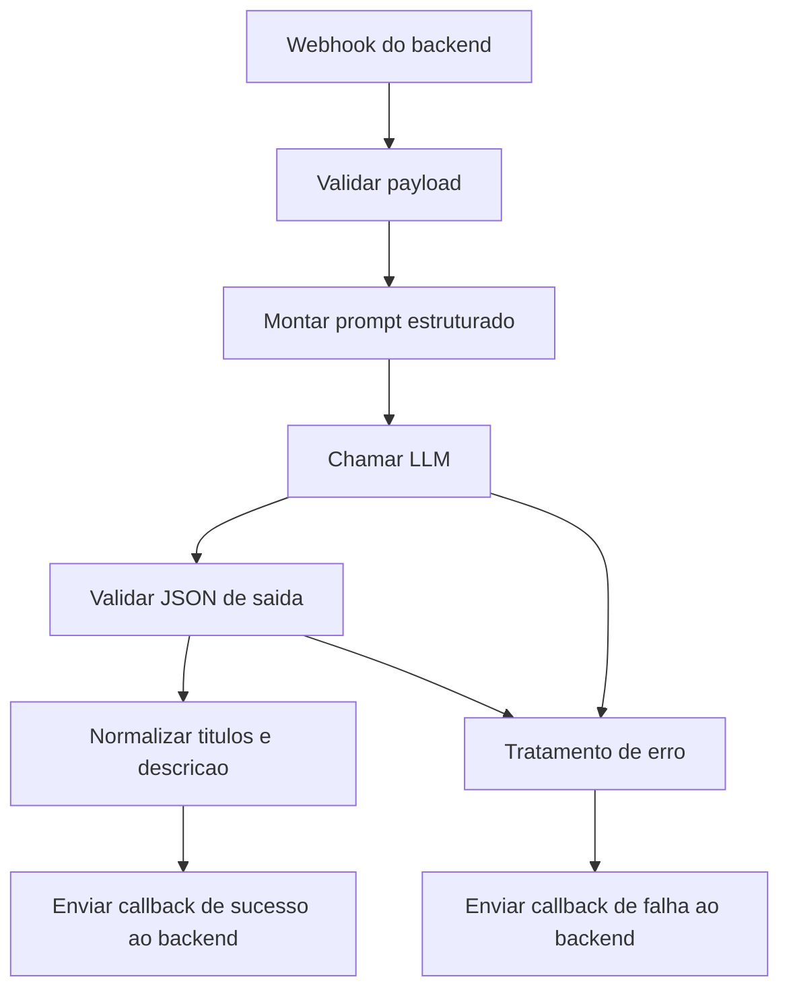
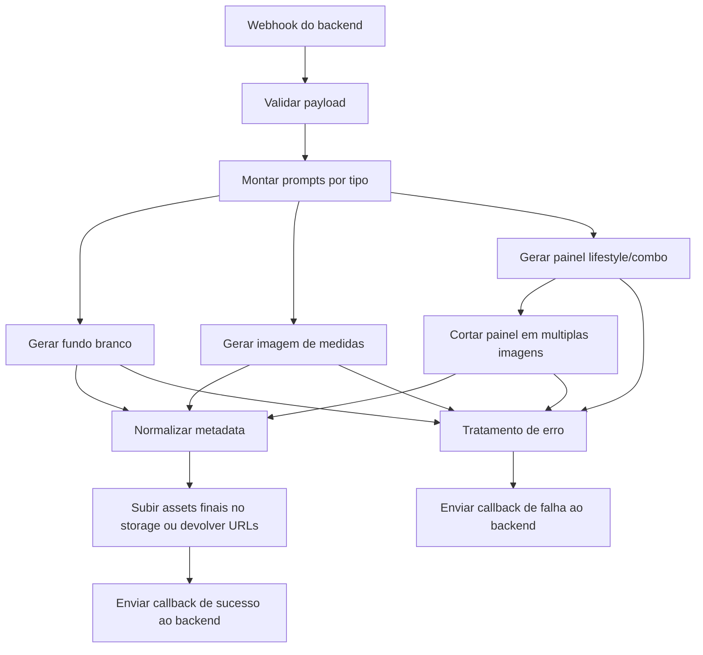

# Workflows n8n do MVP STLAI

## Objetivo

Definir como o `n8n` deve orquestrar os fluxos de texto e imagem no MVP sem virar a camada principal de negocio.

Principio central:

- backend cria o job
- backend chama o n8n
- n8n executa
- n8n devolve callback para o backend

## Workflows recomendados

Para o MVP eu criaria 3 workflows:

1. `wf_text_generation`
2. `wf_image_generation`
3. `wf_image_regeneration`

Video fica fora do escopo inicial.

## 1. Workflow de geracao de texto

Nome:

`wf_text_generation`

### Entrada esperada

Payload enviado pelo backend:

```json
{
  "jobId": "job_uuid",
  "projectId": "project_uuid",
  "language": "pt-BR",
  "product": {
    "name": "Chaveiro cachorro articulado",
    "category": "Acessorios",
    "context": "Produto artesanal para bolsa e mochila",
    "dimensions": {
      "x": 3,
      "y": 2,
      "z": 1.5
    },
    "attributes": {
      "material": "Madeira",
      "color": "Bege"
    }
  },
  "sourceImages": [
    "https://cdn/source1.jpg"
  ],
  "marketplaces": ["shopee", "mercado_livre"],
  "promptVersion": "text_v1"
}
```

### Etapas do workflow



### Nodes sugeridos

- Webhook
- Set
- Function
- HTTP Request
- IF
- HTTP Request callback

### Saida esperada

```json
{
  "jobId": "job_uuid",
  "jobType": "text_generation",
  "provider": "openai",
  "result": {
    "titles": [
      "Titulo 1",
      "Titulo 2",
      "Titulo 3",
      "Titulo 4"
    ],
    "description": "Descricao completa",
    "bullets": [
      "beneficio 1",
      "beneficio 2",
      "beneficio 3"
    ],
    "seoKeywords": [
      "chaveiro artesanal",
      "chaveiro mochila"
    ]
  }
}
```

### Observacoes importantes

- a saida deve ser sempre JSON
- se vier texto fora do schema, o workflow deve falhar
- nao deixar o frontend consumir essa resposta direto

## 2. Workflow de geracao de imagem

Nome:

`wf_image_generation`

### Objetivo

Gerar o pacote padrao de imagens do MVP:

- 1 fundo branco
- 1 medidas
- 4 lifestyle
- 1 caracteristica
- 1 combo

### Entrada esperada

```json
{
  "jobId": "job_uuid",
  "projectId": "project_uuid",
  "language": "pt-BR",
  "preset": "default_8_pack",
  "product": {
    "name": "Chaveiro cachorro articulado",
    "category": "Acessorios",
    "context": "Produto artesanal para bolsa e mochila",
    "dimensions": {
      "x": 3,
      "y": 2,
      "z": 1.5
    }
  },
  "sourceImages": [
    "https://cdn/source1.jpg",
    "https://cdn/source2.jpg"
  ],
  "promptVersion": "img_v1"
}
```

### Estrategia recomendada para MVP

Usar dois modos possiveis:

### Modo A - uma chamada por tipo de imagem

Mais simples de debugar.

Vantagens:

- controle maior
- melhor classificacao de cada output
- erro localizado

Desvantagens:

- mais chamadas
- custo potencialmente maior

### Modo B - painel unico com varias imagens e crop posterior

Mais alinhado com o que voce descreveu.

Vantagens:

- pode reduzir custo
- consistencia visual entre as variacoes

Desvantagens:

- exige pos-processamento
- se a composicao vier ruim, estraga varias imagens de uma vez

### Minha recomendacao real para o MVP

Comecar com modo B apenas para:

- lifestyle
- combo

E gerar separadamente:

- fundo branco
- medidas

Assim voce reduz risco nos outputs mais sensiveis.

### Etapas do workflow



### Saida esperada

```json
{
  "jobId": "job_uuid",
  "jobType": "image_generation",
  "provider": "nano-banana-2",
  "result": {
    "images": [
      {
        "imageKind": "white_background",
        "title": "Catalogo",
        "fileUrl": "https://cdn/catalogo.jpg",
        "width": 1000,
        "height": 1000,
        "variationIndex": 1
      },
      {
        "imageKind": "dimensions",
        "title": "Dimensoes",
        "fileUrl": "https://cdn/dimensoes.jpg",
        "width": 1000,
        "height": 1000,
        "variationIndex": 2
      }
    ]
  }
}
```

## 3. Workflow de regeneracao de imagem

Nome:

`wf_image_regeneration`

Esse workflow pode ser igual ao de imagem, mudando apenas:

- `jobType`
- regra de credito
- variacoes de prompt para tentar novas composicoes

### Recomendacao

Adicionar uma pequena variacao automatica no prompt de regeneracao:

- trocar ambientacao
- trocar composicao
- trocar angulo
- trocar contexto de uso

Assim o usuario percebe valor real na regeneracao.

## 4. Prompts no n8n ou no backend?

Minha recomendacao:

- templates mestre ficam versionados no backend ou repositorio
- n8n apenas recebe a versao e monta payload final

Exemplo:

- `text_v1`
- `img_v1`
- `img_regen_v1`

Nao recomendo deixar o prompt inteiro hardcoded em varios nodes do n8n porque isso fica ruim de manter.

## 5. O que o n8n deve receber do backend

Sempre mandar payload completo.

Minimo necessario:

- `jobId`
- `projectId`
- `userId` se fizer sentido
- `sourceImages`
- `product context`
- `language`
- `promptVersion`
- `callbackUrl`
- `internalToken`

## 6. O que o n8n nunca deve decidir sozinho

- saldo de creditos
- permissao do usuario
- plano contratado
- estado oficial do projeto
- aprovacao de texto

## 7. Estrategia de falha e retry

### Falhas transientes

Exemplos:

- timeout do provider
- rate limit
- erro temporario de rede

Acao:

- retry automatico 2 ou 3 vezes

### Falhas definitivas

Exemplos:

- payload invalido
- imagem corrompida
- resposta fora do schema repetidamente

Acao:

- encerrar workflow
- callback de erro para backend

## 8. Callbacks para o backend

### Sucesso

O `n8n` envia:

- `jobId`
- `provider`
- `result`

### Erro

O `n8n` envia:

- `jobId`
- `provider`
- `errorCode`
- `errorMessage`

### Seguranca

Usar:

- header `x-internal-token`
- idempotency key

## 9. Status no frontend

O frontend nao precisa saber do `n8n`.

Ele so consulta:

- `GET /jobs/:jobId`
- `GET /projects/:projectId/summary`

## 10. Ordem de implementacao dos workflows

1. `wf_text_generation`
2. `wf_image_generation` com 4 imagens primeiro
3. expandir para 8 imagens
4. `wf_image_regeneration`
5. workflow de video depois

## 11. Estrutura pratica dos nodes no n8n

### Texto

- Webhook Trigger
- Validate Payload
- Build Prompt
- Call Model
- Parse JSON
- Success Callback
- Error Callback

### Imagem

- Webhook Trigger
- Validate Payload
- Build Prompt White Background
- Build Prompt Dimensions
- Build Prompt Lifestyle Panel
- Call Image Provider
- Crop Output
- Upload/Normalize URLs
- Success Callback
- Error Callback

## 12. Minha recomendacao final para o n8n

Use o `n8n` como camada de execucao rapida, nao como coracao do sistema.

Se o MVP validar:

- parte do que esta no `n8n` pode continuar nele
- parte mais critica pode migrar para workers dedicados

Esse desenho evita retrabalho agora e tambem evita travar a evolucao depois.
